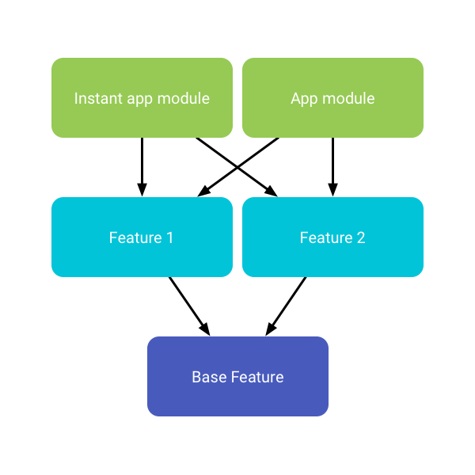

@title[Introduction]

# <span class="gold">Instant App</span>

### Modular Architecture with Android Gradle Plugin 3.0
<br>
<br>
<span class="byline">[luigi.papino@gmail.com ]</span>

---

@title[Instant App - What?]

#### Android Apps Without Installation


---
@title[Instant App - Why?]
### Remove install friction
> Vimeo has seen sessions more than double in length (+130% increase) and native app [users increase 20%.][1] 

<br>

> NYTimes Crossword is used more frequently and those using the instant app have [more than doubled the number of sessions.][2] 

[1]: https://developer.android.com/stories/instant-apps/vimeo.html
[2]: https://developer.android.com/stories/instant-apps/nytimes-crossword.html

---
@title[Instant App - How?]
### App split by module


[1]: https://developer.android.com/topic/instant-apps/getting-started/structure.html "AIA Structure" 


---
#### No more <span class="gray">Keynote</span>.
#### No more <span class="gray">Powerpoint</span>.
<br>
#### Just <span class="gold">Markdown</span>.
#### Then <span class="gold">Git-Commit</span>.

---?code=assets/md/hello.md&title=Step 1. PITCHME.md

<br>
#### Create slideshow content using GitHub Flavored Markdown in your favorite editor.

<span class="aside">It's as easy as README.md with simple slide-delimeters (---)</span>

---

@title[Step 2. Git-Commit]

### <span class="gold">STEP 2. GIT-COMMIT</span>
<br>

```shell
$ git add PITCHME.md
$ git commit -m "New slideshow content."
$ git push

Done!
```

@[1](Add your PITCHME.md slideshow content file.)
@[2](Commit PITCHME.md to your local repo.)
@[3](Push PITCHME.md to your public repo and you're done!)
@[5](Supports GitHub, GitLab, Bitbucket, GitBucket, Gitea, and Gogs.)

---

@title[Step 3. Done!]

### <span class="gold">STEP 3. GET THE WORD OUT!</span>
<br>

<br>
<br>
#### Instantly use your GitPitch slideshow URL to promote, pitch or present absolutely anything.

---

@title[Slide Rich]

### <span class="gold">Slide Rich</span>

#### Code Presenting for Blocks, Files, and GISTs
#### Image, Video, Chart, and Math Slides
#### Multiple Themes with Easy Customization
<br>
#### <span class="gold">Plus collaboration is built-in...</span>
#### Your Slideshow is Part of Your Project
#### Under Git Version Control within Your Git Repo

---

@title[Feature Rich]

### <span class="gold">Feature Rich</span>

#### Present Online or Offline
#### With Speaker Notes Support
#### Print Presentation as PDF
#### Auto-Generated Table-of-Contents
#### Share Presentation on Twitter or LinkedIn

---

### Go for it.
### Just add <span class="gold">PITCHME.md</span> ;)
<br>
[Click here to learn more @fa[external-link fa-pad-left]](https://github.com/gitpitch/gitpitch/wiki)