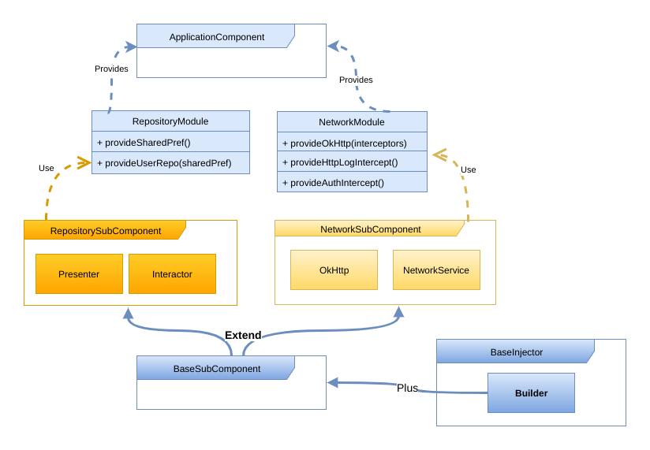
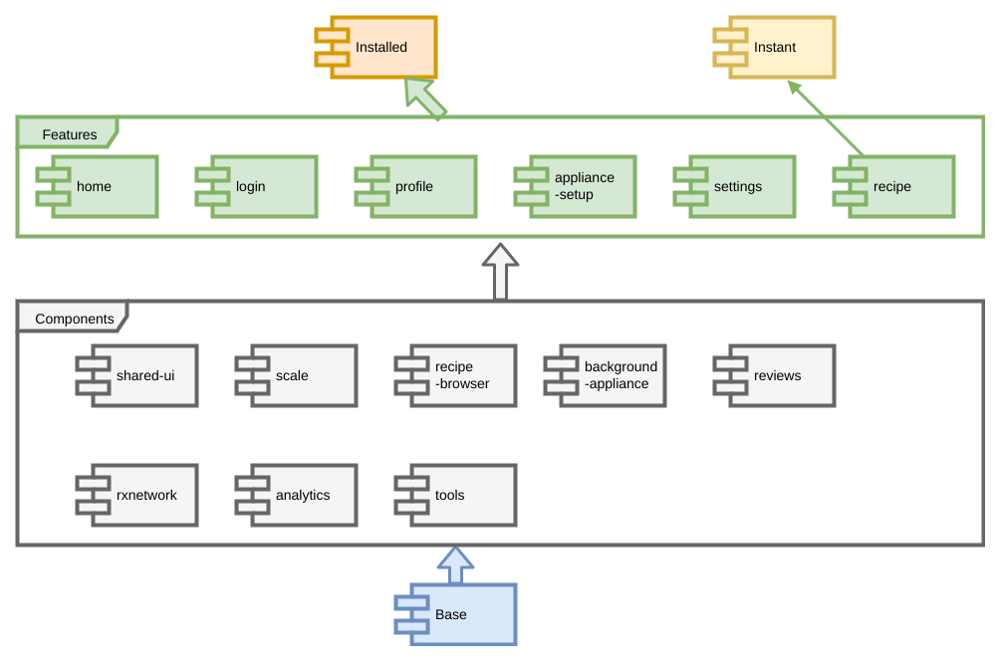

@title[Introduction]

# <span class="gold">Instant App</span>

### Modular Architecture with Android Gradle Plugin 3.0
<br>
<br>
<span class="byline">[luigi.papino@gmail.com - I Hate Android]</span>

---
@title[Instant App - What? email flow]

#### Android Apps Without Installation


Note:
- the system install, open and pass the URL
- works on Google page result
---
@title[Instant App - Why?]
### Remove install friction
> Vimeo has seen sessions more than double in length (+130% increase) and native app [users increase 20%.][1] 

<br>

> NYTimes Crossword is used more frequently and those using the instant app have [more than doubled the number of sessions.][2] 

[1]: https://developer.android.com/stories/instant-apps/vimeo.html
[2]: https://developer.android.com/stories/instant-apps/nytimes-crossword.html

Note:
1) Link on the web as Ads or a button on your website
2) Search on the Google Play Store

---
@title[Instant App - What? install prompt]

#### AIA- Install Prompt


---
@title[Instant App - What? show case]

#### * AIA - Drop Recipes presentation


---
@title[Instant App - How?]
#### App split by module


[^3]: https://developer.android.com/topic/instant-apps/getting-started/structure.html "AIA Structure" 

Note:
Don't need to mantain two different projects

---
@title[Instant App - AS How?]
#### App split by module - Android Studio


---
@title[Instant App - Base/Gradle]
#### base/build.gradle
```gradle
apply plugin: 'com.android.feature'
android {
  baseFeature true
  ...
}
dependencies {
  application project(':app-installed')
  feature project(':feature-home')
  feature project(":feature-details")
  ...
}
```

@[1](very similar to `com.android.library`, Google says)
@[3](flag this module as base feature for this project)
@[7](the base feature must know the application module, needed for the `applicationId` and flavors)
@[8-9](feature modules that this base feature will serve)

Note:
needed to understand tha packageId
---
@title[Instant App - Installed/Gradle]
#### app-installed/build.gradle
```gradle
apply plugin: 'com.android.application'
android { ... }
dependencies {
    implementation project(':feature-home')
    implementation project(":feature-details")
    implementation project(':base')
}

```

@[1](nothing changed)
@[4-6](features and base modules that are part of the installed app)

---
@title[Instant App - Instant/Gradle]
#### app-instant/build.gradle
```gradle
apply plugin: 'com.android.instantapp'
dependencies {
    implementation project(':feature-home')
    implementation project(":feature-details")
    implementation project(':base')
}
```

@[1](instantapp plugin that will generate the .zip file with all the features)
@[3-5](features and base modules that are part of the installed app)

---
@title[Instant App - Feature/Gradle]
#### feature-home/build.gradle
```gradle
apply plugin: 'com.android.feature'
apply plugin: 'kotlin-android'
apply plugin: 'kotlin-android-extensions'
android { ... }
dependencies {
    implementation project(':base')
...   
}
```

@[1](very similar to `com.android.library`, Google says)
@[6](dependency on base module)

---
@title[Instant App - APK Installed]
#### * Installed APK


---
@title[Instant App - APK Instant]
#### * Instant zip


---
@title[Instant App - Issues]
### AIA Issues
- Multi-features not working (fixed last week, Google says)
- 4MB base+feature size limit
- Proguard not working
- ButterKnife/AndroidAnnotation needs workaround for view-injection
- Crashlytics has to be applied in the base.gradle
- Base module resources need to be referenced full-scoped
- Resources in the feature manifest file has to be in the base module

 
---
@title[Multi-Module]
## Multi-Module Project

- Build SpeedUp
- Encapsulation

---
@title[Multi-Module - Structure]
#### AIA not necessary to build a multi-module project 


---
@title[Multi-Module - Google I/0 2017 Painful]

#### Modularity is painful


Note:
Jerome Dochez (Tech Lead Build system Android Studio)
speeding up your build
---
@title[Multi-Module - Google I/0 2017 Dagger2]

#### Modularity and Dagger2


Note:
33:27 much faster

---
@title[Dagger2]
# Dagger2
## Dependency Injection

---
@title[Dagger2 - Definition]

### Dagger2
> [Dagger 2 is a compile-time evolution approach to dependency injection.][1] Taking the approach started in Dagger 1.x to its ultimate conclusion, Dagger 2.x eliminates all reflection, and improves code clarity by removing the traditional ObjectGraph/Injector in favor of user-specified @Component interfaces.

[1]: https://github.com/google/dagger

---

@title[Dagger2 - Dependency Graph]
#### Dependency Graph


---

@title[Dagger2 - Application]
##### Dependency Graph - Application


---

@title[Dagger2 - Application Component]
##### Dagger2 - Application Component 
```kotlin
@Singleton
@Component(modules = arrayOf(NetworkModule::class, RepositoryModule::class, SubcomponentModule::class))
interface ApplicationComponent : AndroidInjector<MyApplication> {
  val userRepository: UserRepository
  val apiService: ApiService
  fun browserBuilder(): BrowserSubComponent.Builder
}

@Module
object NetworkModule {
  @Provides
  @Singleton
  @JvmStatic
  fun provideApiService(okHttp: OkHttp): ApiService {
    return ApiSerive(okHttp)
  }
 }
```

@[2](component declaration with list of modules)
@[4-5](dependecy exposed)
@[6](subcomponent builder)
@[9-10](module declaration)
@[11](this is a provide method for UserRepository)
@[14-16](build the dependency)


---
@title[Dagger2 - Application Injection]
##### Dagger2 - Application Injection 
```kotlin
class MyApplication : BaseApplication() {
  @Inject
  internal lateinit var apiService: ApiService
  override fun onCreate() {
    appComponent = DaggerApplicationComponent
      .builder()
      .create(this)
    appComponent.inject(this)
  }
}
```
@[2-3](dependecy to be injected)
@[5-7](component creation)
@[8](application injection)
---
@title[Dagger2 - Main]
##### Dependency Graph - Browser


---
@title[Dagger2 - Browser SubComponent]
##### Dagger2 - Browser SubComponent
 
```kotlin
@Browser
@Subcomponent(modules = [(BrowserModule::class)])
interface BrowserSubComponent : AndroidInjector<AppCompatActivity> {
  val browserService: BrowserService
  @Subcomponent.Builder
  abstract class Builder: AndroidInjector.Builder<AppCompatActivity>()
}

@Module
object BrowserModule{
  @Browser @Provides @JvmStatic
  fun provideBrowserService(okHttp: OkHttp): BrowserService {
    return BrowserService(okHttp)
  }
  @Browser @Provides @JvmStatic
  fun provideBrowserInteractor(browserService: BrowserService): BrowserInteractor {
    return BrowserInteractor(browserService)
  }
  @Browser @Provides @JvmStatic
  fun provideBrowserPresenter(interactor: BrowserInteractor): BrowserPresenter {
    return BrowserPresenter(interactor)
  }
}
```
@[5-6](builder for this subcomponent to be used in the parent component)

---

@title[Dagger2 - Browser Injection]
##### Dagger2 - Browser Injection
 
```kotlin
class BrowserActivity: AppCompatActivity(){
  @Inject
  internal lateinit var presenter: BrowserPresenter

  override fun onCreate(savedInstanceState: Bundle?) {
    super.onCreate(savedInstanceState)
    (application as MyApplication).component
        .browserBuilder()
        .build()
        .inject(this)
    presenter.iHateAndroid()
  }
}
```
@[7](retrieve AppComponent from Application )
@[8-10](build and inject)
@[11](presenter can be used)
---

@title[Dagger2 - Subcomponent Builders]
##### Dependency Graph - Subcomponent Builders


---

@title[Dagger2 - Modules]
##### Dependency Graph - Modules 


---

@title[Dagger2 - Components Dependency]
##### Dependency Graph - Components


---
@title[Dagger2 - Browser Component]
##### Dependency Graph - Browser Component
```kotlin
@Browser
@Component(modules = [(BrowserModule::class)],
      dependencies = [(AppComponent::class)])
interface BrowserComponent : AndroidInjector<AppCompatActivity> {
  @Component.Builder
  abstract class Builder: AndroidInjector.Builder<AppCompatActivity>(){
      abstract fun plus(component: AppComponent): Builder
  }
}
```
@[2-3](SubComponent --> Component; dependency to AppComponent)
@[7](explicity declare to Dagger2 that this builder will accept and AppComponent instance)
---
@title[Dagger2 - Browser Injection]
##### Dependency Graph - Browser Injection
```kotlin
class BrowserActivity : AppCompatActivity() {
  override fun onCreate(savedInstanceState: Bundle?) {
    super.onCreate(savedInstanceState)
    DaggerBrowserComponent
        .builder()
        .plus((application as MyApplication).component)
        .build()
        .inject(this)
  }
}
```
@[4-5](the builder is not generate by AppComponent)
@[6](we have to feed this component, with an AppComponent instance)
@[7-8](inject as usual)

---

@title[Dagger2 - Components OkHttp]
##### Dependency Graph - Bind graph access


---

@title[Dagger2 - Components OkHttp]
##### Dependency Graph - Bind graph access


---

@title[Dagger2 - Application Component]
##### Dagger2 - Application Component 
```kotlin
@Singleton
@Component(modules = arrayOf(NetworkModule::class, RepositoryModule::class))
interface ApplicationComponent : AndroidInjector<MyApplication> {
  val userRepository: UserRepository
  val apiService: ApiService
  val okHttp: OkHttp
}
```

@[6](explose okHttp)

---

@title[Dagger2 - Components split]
##### Dependency Graph - Components split


---
@title[Dagger2 - Base Injector]
##### Dagger2 - BaseInjector

```kotlin
interface BaseInjector<T : BaseApplicationProvider> : AndroidInjector<T> {
  abstract class Builder<T : BaseApplicationProvider> : dagger.android.AndroidInjector.Builder<T>() {
  
    abstract fun plus(component: BaseSubComponent): Builder<T>

    fun inject(activity: T) {
      plus(activity.baseApplication.provideBaseSubComponent())
      create(activity).inject(activity)
    }
  }
}
```

@[1](BaseInjector for any class that can provide an Application instance)
@[2](BaseInjector.Builder)
@[4](declaring the BaseSubcomponent instance )
@[6-9](add base component instance; create component; inject component)

---
@title[Route]
# Route

---
@title[Route - Why?]
#### StartActivity in another feature
```kotlin
class BrowserActivity : BaseActivity(){
  fun startLogin(){
    startActivity(Intent(context, LoginActivity::class.java))
  }
}
```

@[1](BrowserActivity in the Browser feature)
@[3](start LoginActivity in the Login feature)

---
@title[Route - How? Kotlin]
#### StartActivity through a URI
```kotlin
class BrowserActivity : BaseActivity(){
  fun startLogin(){
    val uri = Uri.Builder()
      .scheme("https")
      .authority("getdrop.com")
      .appendPath("login")
      .build
      
      startActivity(intent(this, uri))
  }
}
```
@[3-7](build the URI)
@[9](start activity through the URI)

---
@title[Route - How? Kotlin]
#### LoginRoute in the Base module
```kotlin
object LoginRoute: BaseRoute{
  fun startLogin(context: Context){
    val uri = Uri.Builder()
      .scheme("https")
      .authority("getdrop.com")
      .appendPath("login")
      .build
      
      startActivity(intent(context, uri))
  }
}
```

---
@title[Route - How? XML]
#### LoginRoute in the Base module
```xml
   <activity...>
      <intent-filter>
        <action android:name="android.intent.action.VIEW"/>

        <category android:name="android.intent.category.DEFAULT"/>
        <category android:name="android.intent.category.BROWSABLE"/>

        <data 
            android:scheme="https"
            android:host="getdrop.com"
            android:pathPrefix="login"
            />
      </intent-filter>
    </activity>
```

@[2-6](intent filter with action.View)
@[8-12](uri served)

---
@title[Route - Complex]
#### * RecipeRoute with UriData
```kotlin
class RecipeRoute : DropRoute {

  enum class Action { SHOW_ABOUT, SHOW_MAKE, QUIT }

  class Data(uri: Uri? = null) : UriData(uri) {
    constructor(recipeId: String, action: Action = SHOW_ABOUT) : this() {
      this.recipeId = recipeId
      this.action = action.toString()
    }
    var recipeId by map
    var action by map
  }

  companion object {
     fun start(context: Context, data: Data, bundle: Bundle = Bundle()) {
      DropRoute.start(context, uri(context, data), bundle)
    }
  }
}
```
@[5-12](UriData to store query parameters in the URI)
@[10-12](store query parameters in an HashMap)

---
@title[Drop - Architecture]
# Drop Recipe - Architecture

---
@title[Dagger2 - Components split]


---
@title[Dagger2 - Components split]


@title[Dagger2 - Build time]

